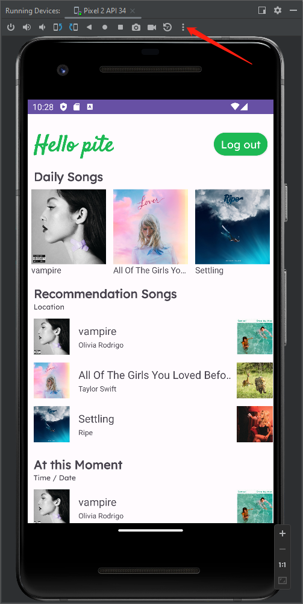
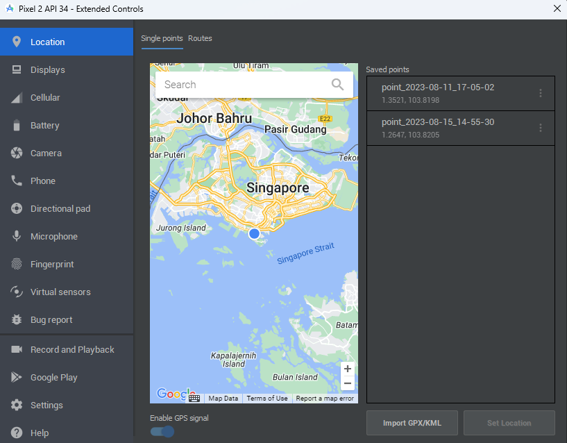

# Environment

Android Studio version: Giraffe

Language: Java

Minimum SDK : API 29("Q";Android 10.0)

Build configuration language: Kotlin DSL (build.gradle.kts)[Recommended]

## Dependencies
### retrofit2
Connect to Java RESTFul API

### glide
Download image

### google-play-services-location
Access user location.

For send latitude & longitude to Java RESTFul API using Android Studio Emulator, you need change the location manually.

### configure your base url
    private static Retrofit retrofit = new Retrofit.Builder()
            .baseUrl("http://your ipv4 address:8080")
            .addConverterFactory(GsonConverterFactory.create())
            .client(okHttpClient)
            .build();
    
    How to get your ipv4 address?
    Open command line, enter "ipconfig", press enter key, then you will see your ipv4 adress. 
    Replace baseUrl in Retrofit.Builder() with your own address.