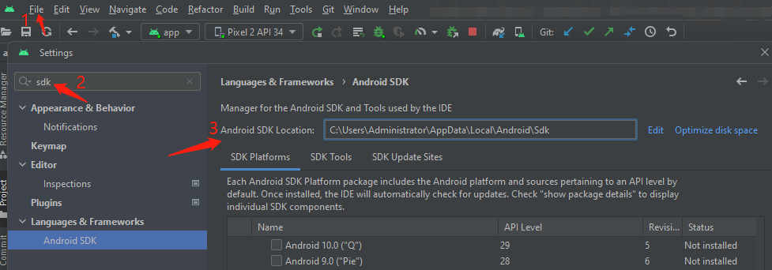
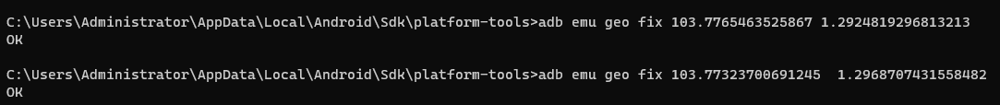

# Environment

Android Studio version: Giraffe

Language: Java

Minimum SDK : API 29("Q";Android 10.0)

Build configuration language: Kotlin DSL (build.gradle.kts)[Recommended]

## Dependencies
### retrofit2
Connect to Java RESTFul API

### glide
Download image

### google-play-services-location
Access user location.

For send latitude & longitude to Java RESTFul API using Android Studio Emulator, you need change the location manually.


### configure your base url
    private static Retrofit retrofit = new Retrofit.Builder()
            .baseUrl("http://your ipv4 address:8080")
            .addConverterFactory(GsonConverterFactory.create())
            .client(okHttpClient)
            .build();
    
    How to get your ipv4 address?
    Open command line, enter "ipconfig", press enter key, then you will see your ipv4 adress. 
    Replace baseUrl in Retrofit.Builder() with your own address.


### Use adb cmd tool to fake/change location
    adb emu geo fix <longitude value> <latitude value>

1. Run your Emulator first

2. Find your android sdk path:

   ```
    File -> Settings -> search "SDK" -> Android sdk location -> Your-sdk-location/platform-tools/
    
    e.g. 
    C:\Users\Administrator\AppData\Local\Android\Sdk\platform-tools
   ```

3. Open cmd, cd to your android-sdk/platform-tools/

4. Enter adm cmd line as above, replace latitude and longitude with the value you wanna test

if your cmd reply with "Ok", refresh Android app for new location.





### Address for test:

	1.NUS ISS: 
		adb emu geo fix 103.7765463525867 1.2924819296813213
	
	2.NUS Central Liabrary: 
		adb emu geo fix 103.77323700691245  1.2968707431558482
		
	3.College Avenue West, Education Resource Centre, Singapore: 
		adb emu geo fix 103.77269738327577 1.3059057415194406
		
	4.Vivo City: 
		adb emu geo fix 103.82212859172847 1.265141682514245

